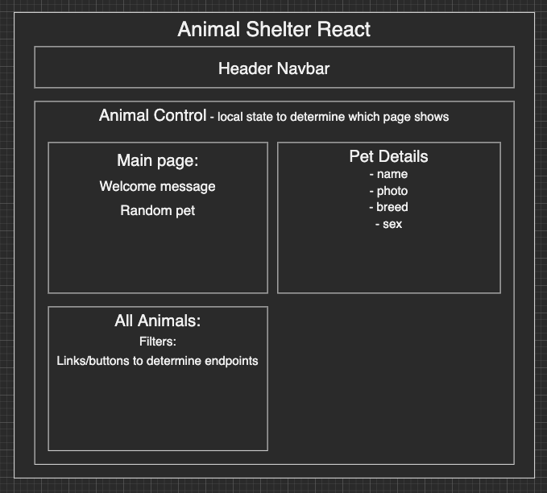

# _Lonely Friends Animal Shelter_

#### _React week 5 React with APIs Practice Project for Epicodus Bootcamp_

#### Created By: **Frank Proulx & Christopher Neal**

## Technologies Used

- _HTML_
- _CSS_
- _Javascript_
- _React_
- _npm_
- _Babel_
- _Ruby on Rails API_

## Description

_This project was created for Epicodus bootcamp to show proficiency in React frontend using a Ruby on Rails API backend. The application is for an animal shelter to list available pets. The user has full CRUD functionality on the animal listings._

## Project Layout Diagram

## Setup/Installation Requirements

- _React_
- _Ruby v2.6.5 recommended_
- _Postgres v12.9_
(Note: Ruby gem dependencies will be installed automatically by Bundler.)

### Basic Setup
- **First**, clone the API repository: [https://github.com/Frank-Proulx/w13_animal_shelter](https://github.com/Frank-Proulx/w13_animal_shelter)
- From the main API directory, run `bundle install` in the terminal to populate gems.
- To create a database, enter `rake db:setup` in your terminal and ensure the database was populated.
- Run `rails s` to start the Rails server on `localhost:3000`  
- **Then**, clone the GitHub repository: [https://github.com/Frank-Proulx/animal-shelter-react](https://github.com/Frank-Proulx/animal-shelter-react)  
- From the main project directory, run `npm install` in the terminal to load necessary plugins and packages.
- Run `npm run start` to start the application.
- React will prompt you to start the server on `localhost:3001`, enter 'y' to confirm.

## Known Bugs

_None at this time_

## License

_[MIT](https://opensource.org/licenses/MIT)_
Copyright (c) _2022_ _Frank Proulx and Christopher Neal_

